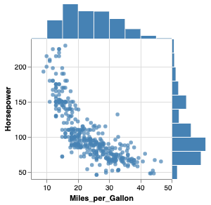

.. _visualization-typology:

============
Visualization Typology
=================================

+---------------------+-----------------------------------------------------+----------------------------+---+
| Visualization Name  | Image                                               | Analytical Use             |   |
+=====================+=====================================================+============================+===+
| :ref:`jointplot`    | .. image:: ../_static/example_thumbs/jointplot.png  | Distribution, Correlation  |   |
+---------------------+-----------------------------------------------------+----------------------------+---+
| :ref:`pairplot`     | .. image:: ../_static/example_thumbs/pairplot.png  | Distribution, Correlation  |   |
+---------------------+-----------------------------------------------------+----------------------------+---+
| :ref:`lineplot`     | .. image:: ../_static/example_thumbs/lineplot.png  | Change over interval       |   |
+---------------------+-----------------------------------------------------+----------------------------+---+
| :ref:`hist`         | .. image:: ../_static/example_thumbs/hist.png  | Numerical Distribution     |   |
+---------------------+-----------------------------------------------------+----------------------------+---+
| :ref:`countplot`    | .. image:: ../_static/example_thumbs/countplot.png  | Categorical Distribution   |   |
+---------------------+-----------------------------------------------------+----------------------------+---+
| :ref:`scatterplot`  | .. image:: ../_static/example_thumbs/jointplot.png  | Distribution   |   |
+---------------------+-----------------------------------------------------+----------------------------+---+
| :ref:`heatmap`      | .. image:: ../_static/example_thumbs/jointplot.png  | Other                      |   |
+---------------------+-----------------------------------------------------+----------------------------+---+
| :ref:`barplot`      | .. image:: ../_static/example_thumbs/jointplot.png  | Other                      |   |
+---------------------+-----------------------------------------------------+----------------------------+---+
|  :ref:                   |                                                     |                            |   |
+---------------------+-----------------------------------------------------+----------------------------+---+
|                     |                                                     |                            |   |
+---------------------+-----------------------------------------------------+----------------------------+---+
|                     |                                                     |                            |   |
+---------------------+-----------------------------------------------------+----------------------------+---+

:ref:`jointplot`  

:ref:`pairplot`

:ref:`lineplot`    

:ref:`hist`  

:ref:`countplot`  

:ref:`barplot`  

:ref:`heatmap`

:ref:`barplot`

+---------------------+--------+---------------------------+
| Visualization Name  | Image  | Analytical Use            |
+=====================+========+===========================+
| :ref:`jointplot`    | |logo| | Distribution, Correlation |
+---------------------+--------+---------------------------+
| :ref:`pairplot`     | |logo| | Distribution, Correlation |
+---------------------+--------+---------------------------+
| :ref:`lineplot`     | |logo| | Change over interval      |
+---------------------+--------+---------------------------+
| :ref:`hist`         | |logo| | Numerical Distribution    |
+---------------------+--------+---------------------------+
| :ref:`countplot`    | |logo| | Categorical Distribution  |
+---------------------+--------+---------------------------+
| :ref:`heatmap`      | |logo| | Other                     |
+---------------------+--------+---------------------------+
| :ref:`barplot`      | |logo| | Other                     |
+---------------------+--------+---------------------------+
